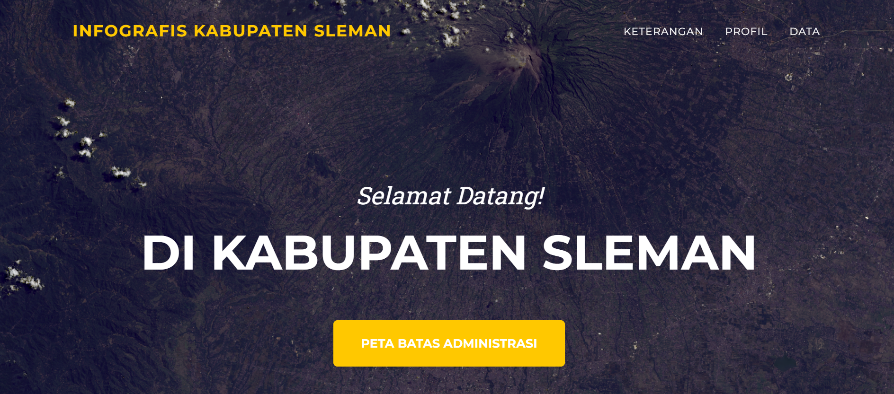
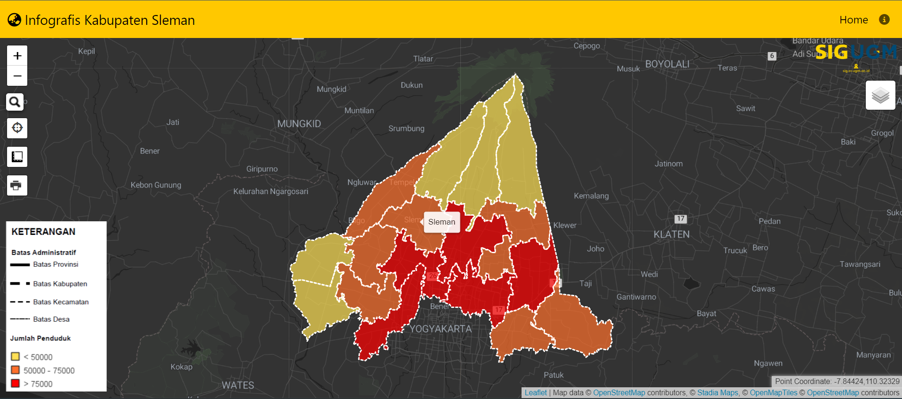

# INFOGRAFIS KABUPATEN SLEMAN

Kabupaten Sleman adalah salah satu kabupaten di Daerah Istimewa Yogyakarta, Indonesia. Berlokasi di bagian utara Yogyakarta, Sleman dikenal karena menjadi tempat berbagai institusi pendidikan ternama seperti Universitas Gadjah Mada (UGM) dan beberapa perguruan tinggi lainnya.

Wilayah Sleman juga memiliki beragam objek wisata, mulai dari Candi Prambanan yang merupakan Situs Warisan Dunia UNESCO, hingga Kaliurang yang terkenal dengan udara sejuknya karena lokasinya yang berada di lereng Gunung Merapi.

Selain itu, Sleman memiliki potensi pertanian yang cukup besar dengan lahan pertanian yang subur. Kabupaten ini terus berkembang baik dari segi industri, pendidikan, pariwisata, dan pertanian.

**Fitur**

- WebGIS
- Geolocation
- Measuring

**Teknologi Pembangun Web**

- Leaflet JS
- MySQL
- Bootstrap
- ApexCharts
- Font Awesome
- Google Fonts

**Preview**

**Sumber Data**
https://slemankab.bps.go.id/
